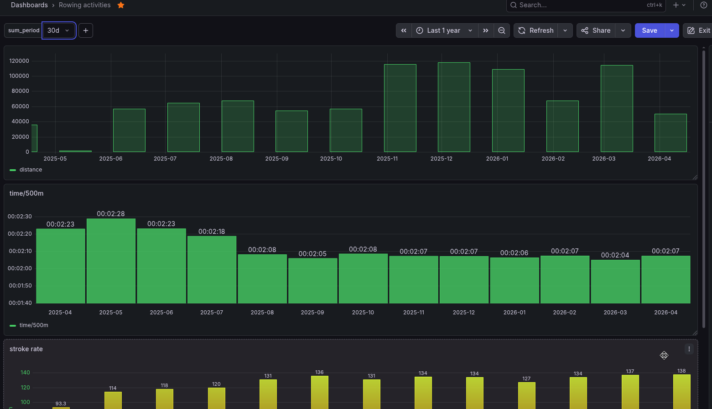

# Concept2 InfluxDB Exporter

Export your Concept2 workout data to InfluxDB.

## Configuration

The exporter reads the following environment variables:

| Variable | Required | Default | Description |
|----------|----------|---------|-------------|
| `CONCEPT2_API_TOKEN` | Yes | - | API token from concept2.com |
| `INFLUX_URL` | Yes* | - | InfluxDB URL (e.g., `http://localhost:8086`) |
| `INFLUX_ORG` | Yes* | - | InfluxDB organization |
| `INFLUX_BUCKET` | Yes* | - | InfluxDB bucket name |
| `INFLUX_TOKEN` | Yes* | - | InfluxDB API token |
| `POLL_INTERVAL_SECONDS` | No | `3600` | How often to sync in seconds. Value <= 0 means run once and exit. |
| `STATE_FILE` | No | `/data/state.json` | Path to store sync state |
| `LOG_LEVEL` | No | `INFO` | Log level (DEBUG, INFO, WARN, ERROR) |

*Required if InfluxDB export is desired.

## Running

```bash
# Build
cargo build --release

# Run
./target/release/concept2-influxdb
```

Or with Docker (see `Dockerfile`):

```bash
docker build -t concept2-influxdb .
docker run -d --name concept2-influxdb \
  -e CONCEPT2_API_TOKEN=xxx \
  -e INFLUX_URL=http://influxdb:8086 \
  -e INFLUX_ORG=myorg \
  -e INFLUX_BUCKET=workouts \
  -e INFLUX_TOKEN=xxx \
  concept2-influxdb
```

## Data Mapped

Workouts are written to InfluxDB with these fields:

- **Tags**: `workout_id`, `username`, `machine_type`, `workout_type`, `date`
- **Fields**: `distance_meters`, `duration_seconds`, `calories`, `stroke_rate_avg`, `heart_rate_avg`

## Grafana Integration

